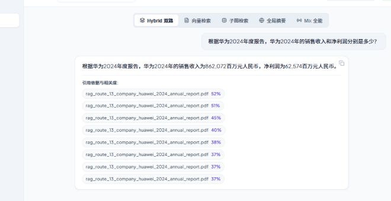

# RAG API Pro

一个面向多租户知识库的 GraphRAG 应用示例。它把文档上传、异步解析、文本分块、向量检索、关键词检索、图谱检索和大模型问答串成一条完整链路，并提供 React 管理界面。



## 能做什么

- 多租户登录、角色权限和知识库隔离；
- PDF、DOCX、TXT 文档上传与解析；
- MinIO 保存原始文件，PostgreSQL 保存业务元数据和任务状态；
- Redis Streams 投递异步处理任务；
- Qdrant 保存向量，Memgraph 保存实体关系；
- 混合检索、GraphRAG 局部/全局检索和 SSE 流式问答；
- 文档索引状态、任务重试、租约恢复、幂等和存储对账；
- Docker Compose 同时启动前端、API、Worker 和基础设施。

## 系统结构

```text
Browser
   │
   ▼
Nginx + React :3000 ──► FastAPI :8000
                              │
          ┌───────────────────┼──────────────────┐
          ▼                   ▼                  ▼
      PostgreSQL          Redis Stream       MinIO
      业务事实源          任务投递            原始文件
          │                   │                  │
          └──────────────► Worker ◄──────────────┘
                              │
                    ┌─────────┴─────────┐
                    ▼                   ▼
                 Qdrant             Memgraph
                 向量索引            图谱索引
```

## 快速启动

需要 Docker Desktop 或 Docker Engine，并确保 Docker Compose 可用。

```powershell
Copy-Item .env.example .env
# 编辑 .env，至少修改 SECRET_KEY、POSTGRES_PASSWORD、MINIO_SECRET_KEY

docker compose config
docker compose up -d --build
docker compose ps
```

浏览器访问：<http://localhost:3000>

API 文档：<http://localhost:8000/docs>

查看日志：

```powershell
docker compose logs -f api worker
```

开发环境默认使用 Mock 模型，适合先验证完整链路。需要真实模型时，设置 `USE_MOCK_MODELS=false`，并填写 `OPENAI_API_KEY`、模型地址和模型名称。复杂 PDF 可以配置 MinerU；原生文本 PDF 可以先关闭 MinerU。

演示数据开启时，初始化账号由应用引导逻辑创建。首次启动后应立即修改密码，并不要把 `.env` 上传到公开仓库。

## 关键设计

PostgreSQL 是任务和文档元数据的事实源，Redis 只负责传递任务事件。上传文档时，业务记录和 Outbox 事件先在 PostgreSQL 中提交，再异步发布到 Redis；Redis 暂时不可用时，事件会保留并重试。

Qdrant 和 Memgraph 是可重建的二级索引。文档列表不会仅凭“数据库里有文档记录”就显示为可检索，而是同时核对任务状态、活动索引版本和 Qdrant 实际向量数量。

## 目录说明

```text
src/api/       FastAPI 路由和应用入口
src/services/  文档、任务和 RAG 业务服务
src/parsers/   文档分析、解析、分块和解析器路由
src/core/      数据库、鉴权、限流、任务可靠性和存储对账
worker/        异步文档处理进程
frontend/      React/Vite 页面和生产 Nginx 配置
scripts/       初始化、对账、备份和运维脚本
```

## 运行边界

这是一个可运行的项目示例和体验部署版本，不等同于完整生产平台。正式部署前应补充正式数据库迁移、HTTPS、密钥管理、备份演练、监控告警、容量压测和更严格的生产权限策略。
